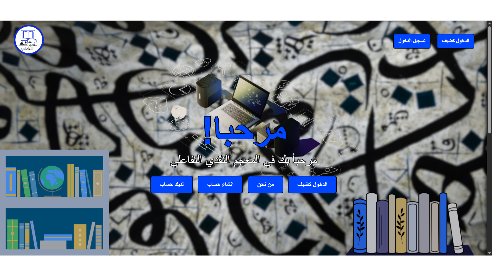
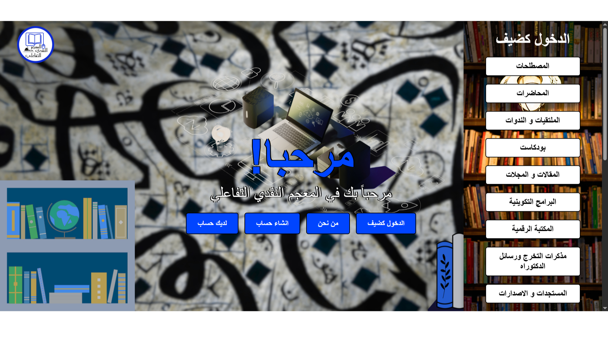
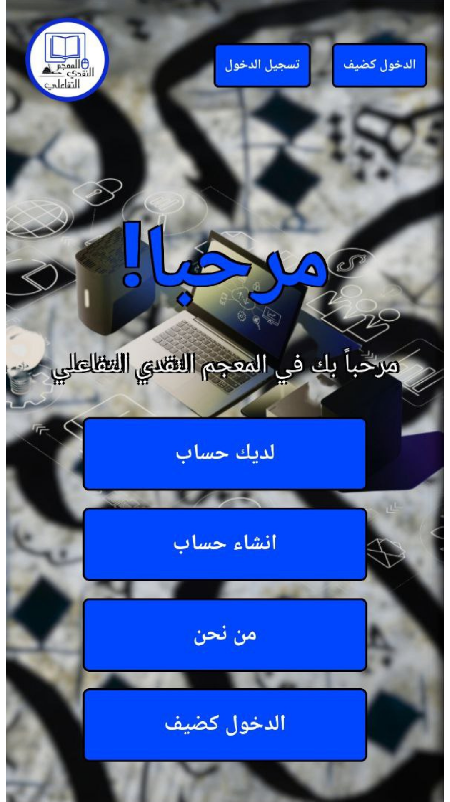
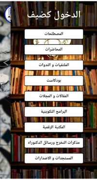

# Interactive Critical Dictionary

This is a modern recreation of the Arabic Language Platform using React, TypeScript, and Tailwind CSS.

المعجم النقدي التفاعلي هو مشروع رقمي يهدف إلى بناء قاعدة معرفية شاملة تجمع أبرز المصطلحات والمفاهيم النقدية في مجال الأدب والنقد، وتعرض بطريقة تفاعلية تمكّن المستخدم من البحث والمقارنة والاطلاع على الشروحات المتعددة للمصطلح الواحد. كما يقدّم ترجمة دقيقة لهذه المصطلحات باللغتين الفرنسية والإنجليزية، لتيسير التواصل المعرفي والانفتاح على الدراسات العالمية. يسعى المعجم إلى توضيح الفروق الدلالية بين المصطلحات، والحد من فوضى الاصطلاح وتضارب المعاني في البحوث الأكاديمية، إضافةً إلى تعزيز الوعي النقدي لدى الباحثين والطلبة، وتوفير أداة علمية دقيقة تواكب التحولات المعرفية الحديثة في الخطاب النقدي العربي.

## 📸 Screenshots






## 🚀 Technologies Used

- **Vite** - Fast build tool and dev server
- **React 18** - UI library
- **TypeScript** - Type-safe JavaScript
- **Tailwind CSS v4** - Utility-first CSS framework
- **@tailwindcss/postcss** - PostCSS plugin for Tailwind

## 📁 Project Structure

```
arabic-platform-react/
├── public/                    # Static assets
│   ├── logo.png              # Logo image
│   ├── arabe3.png            # Hero background image
│   ├── arabe10.png           # Panel background image
│   ├── podcast.mp4           # Podcast video
│   └── *.pdf                 # PDF documents
├── src/
│   ├── components/           # React components
│   │   ├── Header.tsx        # Header with navigation
│   │   ├── Hero.tsx          # Hero section
│   │   ├── SlidePanel.tsx    # Side panel with content
│   │   ├── SubPanel.tsx      # Sub-panel for terms
│   │   ├── ContentPanel.tsx  # Content display panel
│   │   ├── InfoSections.tsx  # Information sections
│   │   └── Footer.tsx        # Footer component
│   ├── App.tsx               # Main application component
│   ├── main.tsx              # Application entry point
│   └── index.css             # Global styles with Tailwind
├── index.html                # HTML template
├── tailwind.config.js        # Tailwind configuration
├── postcss.config.js         # PostCSS configuration
├── vite.config.ts            # Vite configuration
└── package.json              # Dependencies
```

## 🎯 Features

- **Responsive Design** - Works on desktop and mobile devices
- **Interactive Panels** - Side panels that slide in/out
- **Arabic RTL Support** - Proper right-to-left text direction
- **Video Integration** - Embedded YouTube videos and Facebook content
- **PDF Documents** - Direct links to PDF resources
- **Smooth Animations** - Transitions and hover effects
- **Type-Safe** - Full TypeScript support

## 📦 Installation & Usage

```bash
# Navigate to project directory
cd arabic-platform-react

# Install dependencies
npm install

# Start development server
npm run dev

# Build for production
npm run build

# Preview production build
npm run preview
```

## 🌐 Development Server

The development server runs at: **http://localhost:5173/**

## 🎨 Styling

The project uses Tailwind CSS v4 with the new `@tailwindcss/postcss` plugin.

## 📱 Components Overview

- **Header** - Fixed header with logo and navigation
- **Hero** - Full-screen hero with background image and action buttons
- **SlidePanel** - 4 different slide-in panels with unique content
- **SubPanel** - Sub-menu for categorized terms
- **ContentPanel** - Displays PDFs, videos, and training programs
- **InfoSections** - Website and team information
- **Footer** - Copyright information

## 📄 License

Copyright (c) 2025 Alaa Younsi. All rights reserved.
